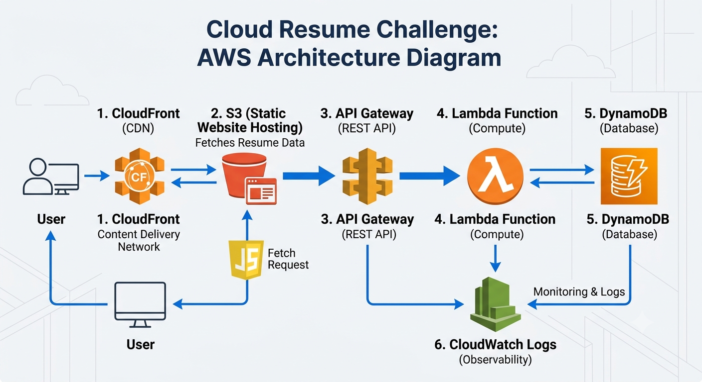
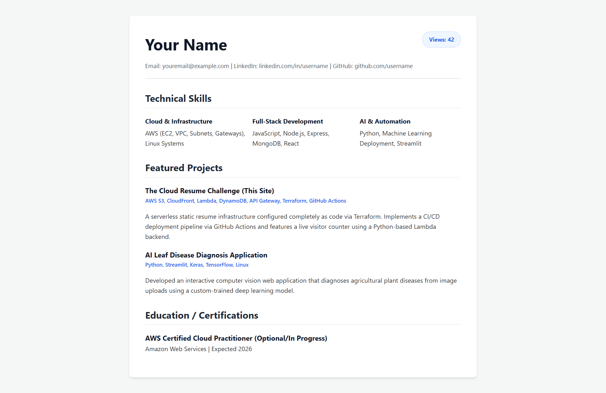
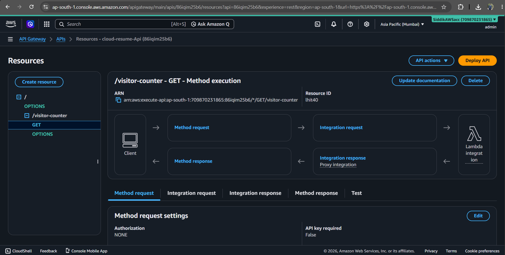
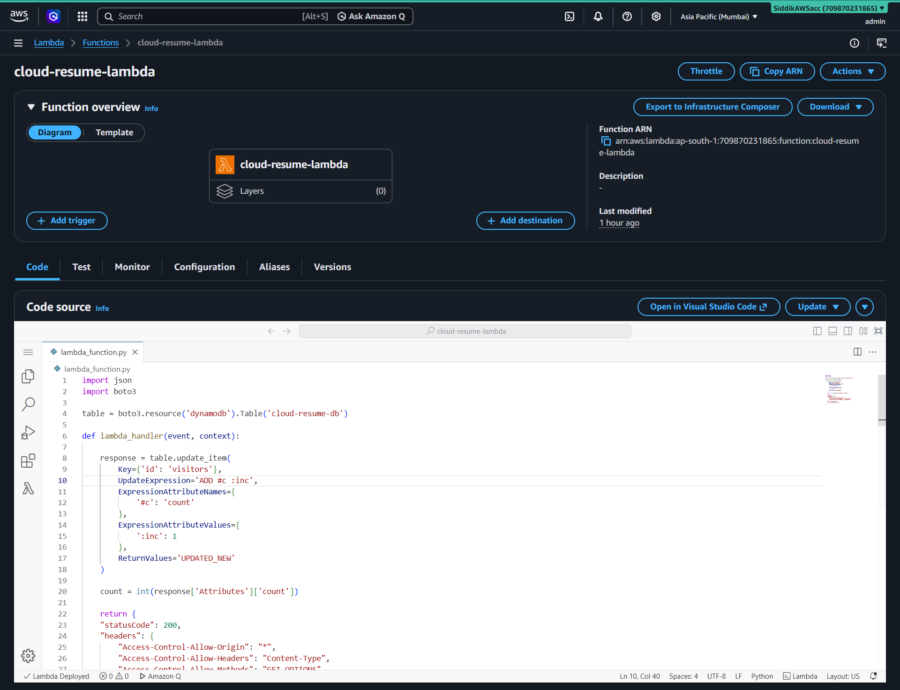
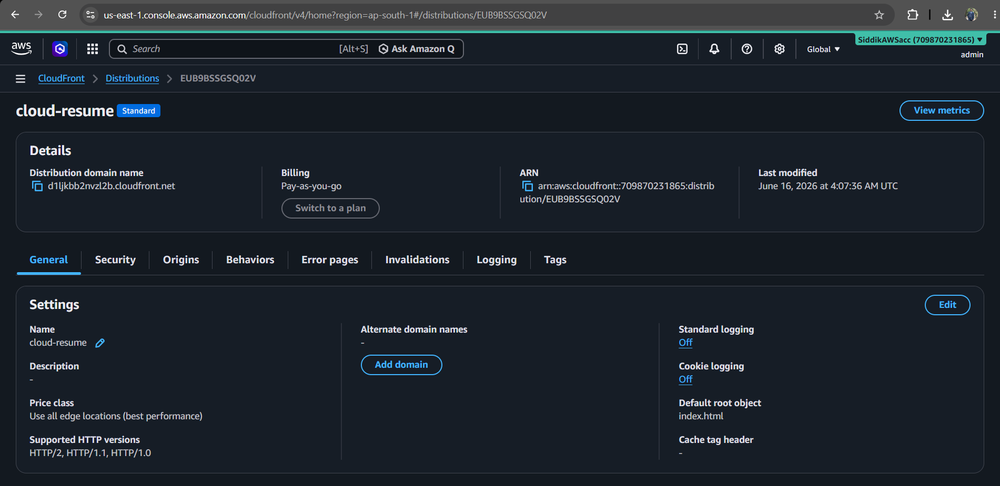

# Cloud Resume Challenge

A serverless cloud resume website built on AWS as part of the Cloud Resume Challenge.

## Live Website

Add your CloudFront URL here:

https://d1ljkbb2nvzl2b.cloudfront.net/

Note: This link will be available based on aws free tier duration. Check screen shots below if link is unavailable.

---

## Project Overview

This project hosts a personal resume website using AWS serverless services. It includes a visitor counter that tracks page views in real time using API Gateway, Lambda, and DynamoDB.

The goal of this project was to gain hands-on experience with cloud infrastructure, serverless computing, IAM permissions, API development, and frontend-backend integration.

---

## Architecture




---

## AWS Services Used

### Amazon S3
- Hosts the static resume website.
- Stores HTML, CSS, and JavaScript files.

### Amazon CloudFront
- Content Delivery Network (CDN).
- Serves the website globally with caching.

### Amazon API Gateway
- Provides REST API endpoint for the visitor counter.

### AWS Lambda
- Serverless backend that updates and retrieves visitor counts.

### Amazon DynamoDB
- Stores visitor counter data.

### AWS IAM
- Manages permissions between AWS services.

### Amazon CloudWatch
- Stores Lambda logs for monitoring and troubleshooting.

---

## Features

- Serverless architecture
- Static website hosting
- Global content delivery through CloudFront
- Visitor counter using DynamoDB
- REST API using API Gateway
- Lambda backend integration
- CloudWatch monitoring

---

## Challenges Faced

### IAM Permission Errors

Encountered:

```
AccessDeniedException
```

Resolved by adding appropriate DynamoDB permissions to the Lambda execution role.

### DynamoDB Data Retrieval

Fixed issues related to:
- Partition key format
- Item retrieval
- JSON serialization

### API Gateway CORS Issues

Encountered browser errors:

```
No 'Access-Control-Allow-Origin' header
```

Resolved by:
- Configuring API Gateway CORS
- Adding OPTIONS method
- Returning proper headers

### CloudFront Caching

Website continued serving older JavaScript versions.

Resolved using CloudFront invalidations:

```
/*
```

---

## Visitor Counter Workflow

1. User opens website.
2. JavaScript sends request to API Gateway.
3. API Gateway invokes Lambda.
4. Lambda updates visitor count in DynamoDB.
5. Updated count is returned.
6. Visitor count is displayed on the website.

---

## Technologies Used

- HTML
- CSS
- JavaScript
- AWS S3
- AWS CloudFront
- AWS Lambda
- AWS API Gateway
- AWS DynamoDB
- AWS IAM
- AWS CloudWatch

---

## Screenshots

Add screenshots here:

### Resume Website



### API Gateway



### Lambda Function



### DynamoDB Table


### CloudFront Distribution



---

## Future Improvements

- GitHub Actions CI/CD
- Terraform Infrastructure as Code
- Custom Domain with Route 53
- HTTPS certificate using ACM
- Automated deployments

---

## Author

**Siddik Mulla**

GitHub: https://github.com/YOUR_USERNAME

LinkedIn: https://linkedin.com/in/YOUR_PROFILE
